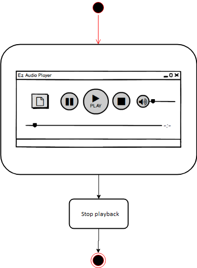

# Диаграммы состояния
---

# Содержание
1 [Выбор аудиофайла для воспроизведения](#select_file)  
2 [Старт / продолжение воспроизведения](#play)  
3 [Приостановка воспроизведения](#pause)  
4 [Остановка воспроизведения](#stop)  
5 [Контроль громкости звука](#volume)  
6 [Контроль времени воспроизведения](#timer) 

<a name="select_file"/>

# 1 Выбор аудиофайла для воспроизведения
  

<a name="play"/>

# 2 Старт / продолжение воспроизведения
  

<a name="pause"/>

# 3 Приостановка воспроизведения

<a name="stop"/>

# 4 Остановка воспроизведения
  

<a name="volume"/>

# 5 Контроль громкости звука
  

<a name="timer"/>

# 6 Контроль времени воспроизведения

