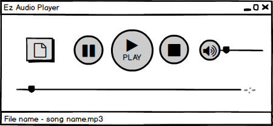

# Требования к проекту
---
# Содержание

# 1 Введение

## 1.1 Назначение
 
В этом документе описаны функциональные и нефункциональные требования к десктоп-приложению «Ez Audio Player». Данный проект предназначен для прослушивания ваших аудиозаписей в офлайн режиме.

## 1.2 Бизнес-требования

### Исходные данные

В наше время музыка является неотъемлемой частью нашего мира. Музыка повсюду. Мы можем услышать ее в магазине, в машине, просто на улице, в кафе, везде. Однако если вы захотите послушать ваши аудиозаписи с вашего компьютера, вы можете воспользоваться десктоп-приложением «Ez Audio Player» с удобным и простым в освоении интерфейсом.

# 2 Требования пользователя

### 2.1 Интерфейс пользователя

- Главное окно плеера

  

### Характеристики пользователей

### 2.3.1 Классы пользователей

| Класс пользователей | Описание |
|:---|:---|
| Обычный пользователь | Пользователи, которые могут пользоваться полным функционалом приложения. |

### 2.3.2 Аудитория приложения

#### 2.3.2.1 Целевая аудитория

 Любой человек, который хочет прослушать свои аудиозаписи.
 
# 3 Системные требования

## 3.1 Функциональные требования

### 3.1.1 Управление воспроизведением

#### 3.1.1.1 Приостановка воспроизведения
Пользователь может приостановить воспроизведение.
#### 3.1.1.2 Старт / продолжение воспроизведения
Пользователь может начать воспроизведение или продолжить его (в случае приостановки) воспроизведение.
#### 3.1.1.3 Остановка воспроизведения
Пользователь может остановить воспроизведение.
#### 3.1.1.4 Контроль громкости звука
 Пользователь может включить / выключить звук и контролировать громкость воспроизведения.
#### 3.1.1.5 Контроль времени воспроизведения 
 Пользователь может контролировать время воспроизведения.

### 3.1.2 Выбор аудиофайла для воспроизведения
Пользователь может выбрать аудиофайл для воспроизведения из файловой системы.

## 3.2 Нефункциональные требования

### 3.2.1 Требования к удобству использования
1. Все элементы приложения должны быть светлыми;
2. Все функциональные элементы пользовательского интерфейса имеют названия или поясняющие иконки (стандартизированные иконки для медиа приложений: play, stop и т.д.), описывающие действие, которое произойдет при выборе элемента.

### 3.2.2 Внешние интерфейсы
Окна приложения удобны для использования пользователями с плохим зрением:
  * размер шрифта не менее 14пт;
  * функциональные элементы контрастны фону окна.

